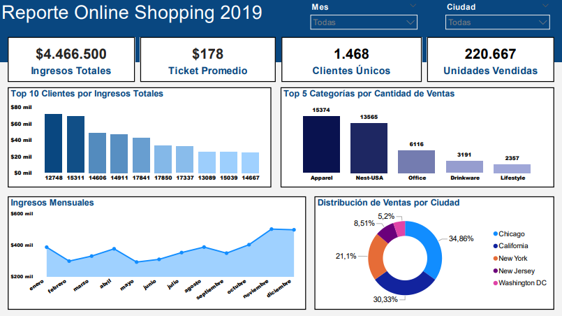

## Análisis de Online Shopping 2019

**Dataset:** Online Shopping Dataset, publicado en Kaggle por Jackson Divakar R.

**Link:** https://www.kaggle.com/datasets/jacksondivakarr/online-shopping-dataset.

Análisis de los datos crudos de las ventas de un Shopping Online durante el año 2019, con el objetivo de comprender las tendencias más importantes de la empresa, rendimiento de ingresos y comportamiento de los clientes para la toma de decisiones.

**Herramientas Utilizadas:** SQL y Power BI.

## Hallazgos

- **Los Ingresos Totales fueron de $4.466.500**, manteniendo un crecimiento progresivo durante la mayor parte del año.

- **Se observa el pico máximo entre noviembre, diciembre**, con un crecimiento aproximado del 67% respecto al mínimo registrado en febrero, pasando de aproximadamente $300.000 a $500.000.

- **La cantidad de unidades vendidas es muy elevada respecto a la cantidad de clientes únicos**, lo que sugiere pedidos de múltiples unidades.

- **Chicago y California generan el 65.2% de las ventas totales**, y New York, con una participación relevante pero menor, presenta claras oportunidades de crecimiento.

- **Las líneas de producto más vendidas fueron Apparel (Ropa) y Nest-USA**, las dos superando por más del doble en volumen de ventas al resto.

## Recomendaciones

- Se recomienda realizar campañas focalizadas en New York, ya que representa el 21.1% de los ingresos totales y presenta un alto potencial de crecimiento.

- Implementar promociones agresivas en febrero del próximo año, con el fin de reducir la caída de ventas posterior a los picos máximos de fin de año.

- Los clientes de IDs 12748 y 15311 tuvieron un gran impacto en los ingresos totales. Se recomienda priorizar la fidelidad de estos clientes a largo plazo.

- Garantizar la disponibilidad constante de los productos Apparel y Nest-USA, y utilizar su alta demanda para impulsar categorías con menor volumen de ventas mediante la venta de productos en combo.

## Datos y Pasos Realizados

**Dataset:** Se trabajó con un dataset el cual, luego del proceso de limpieza y transformación de datos, consta de unos 48.107 registros. Cabe recalcar que los valores NULL y los registros duplicados fueron excluidos a la hora de realizar el análisis. Los campos que se usaron fueron:

CustomerID, Location (ciudades), Transaction_ID, Transaction_Date, Product_Category, Quantity y Avg_Price.

La variable Gender (género) se mantuvo en el modelo, pero fue excluida de los reportes finales para priorizar medidas con mayor impacto en el análisis final.

**Procedimiento:** El estudio se realizó mediante la ejecucion de consultas SQL para extraer y verificar métricas de rendimiento, las cuales fueron recreadas con medidas DAX en Power BI, herramienta donde se llevó a cabo el modelado final de datos y el diseño de las visualizaciones.

